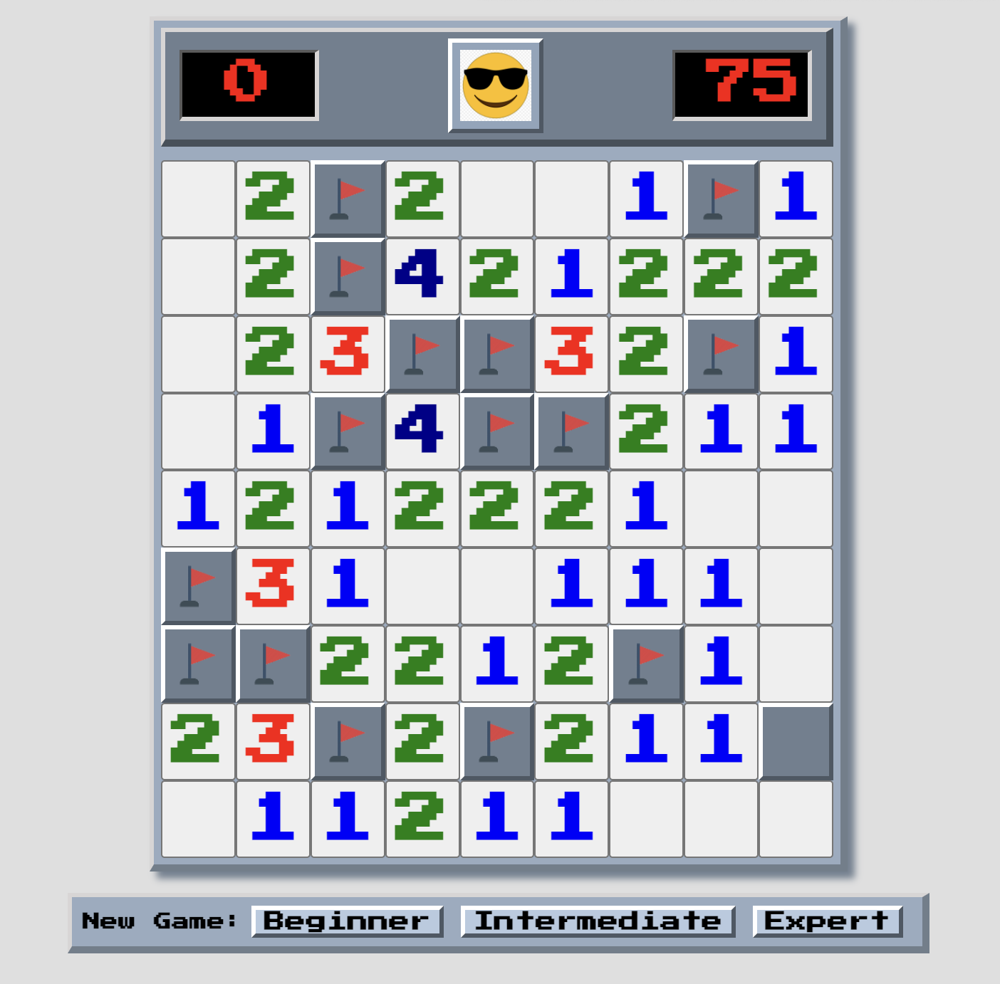

   <h1>:triangular_flag_on_post: Minesweeper :triangular_flag_on_post:</h1>
   
   
   <h5>Tom Gordon</h5>
   <a href="https://github.com/tom-gordon13" target="_blank">
      
   <a href="https://www.linkedin.com/in/thomas-gordon13/" target="_blank">
                                   
   <h1></h1>

<h1>Game Description</h1>
<!-- <h3>Link to game:</h3> -->
<a href='https://tom-gordon13.github.io/Minesweeper/'>Click here to play the game!</a>
 

Originally debuted in 1990, <i>Minesweeper</i> may be the world's most popular time-wasting game. Come re-live the 90's with this rendition of the classic that was partially devised as a way to teach users the basics of mouse control following an era where most computers relied on text-based interaction

 

Left click to dig for a mine. Right click to place a flag. Some things never change, including the ever-present smiley face watching over all. And don't worry, for those <i>Minesweeper</i> experts out there who spent hours mindlessly clicking for mines back in the day, feel free to up the difficulty and prove your mettle.

 

 Gameplay Instructions

| The Basics |  |
|------------ | ------------|
| <h4 align="left">Left-click on a square to check if there is a mine underneath. If a number appears in that square, BEWARE! That is the number of mines underneath adjacent squares!</h4> |  |
| <h4 align="left">Right-click on a square if you believe there is a marker underneath. The tracker in the upper left tells you how many mines remain un-marked, assuming you haven't incorrectly placed a marker.</h4> |  |

 How to Win... or Lose!

| How to Win |  |
|------------ | ------------|
| <h4 align="left">There are two ways to win - either correctly mark all of the squares with mines, or dig up all of the squares without! The smiley will look down upon you fondly if you win.</h4> |  |
| <h4 align="left">If you accidentally left-click on a mine - game over! The smiley will not be happy.</h4> |  |

 Ramping Things Up

| Setting the difficulty |  |
|------------ | ------------|
| <h4 align="left">Are things a little too easy for you? Try ramping things up with intermediate or even expert difficulty!</h4> |  |

 

## Technologies Used

 

 

## :hammer: Work in Progress  

### Keep an eye out for these exciting new features in the future!

- [ ] Add local storage capabilities to track high scores   

- [ ] Add logic where a clicked square will also display all adjacent squares with zero adjacent mindes   

- [ ] Add explosion audio when a mine is clicked

- [ ] Add additional animations for win/loss cases (shaking screen, confetti, etc.)

